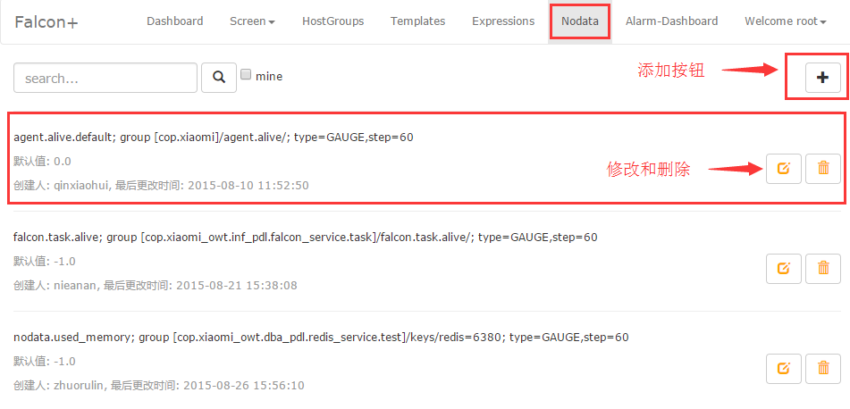

<!-- toc -->

# Nodata Configuration
Two configurations are needed for Nodata: Nodata configuration and strategy configuration. We would like to introduce how to use the Nodata service through an example.

### User's Demand
The user should be informed when the collection of metric `agent.alive` of all the machines in group `cop.xiaomi_owt.inf_pdl.falcon` stops.

### Nodata Configuration
Enter the homepage of Nodata and you can see the configuration list of Nodata.

Click the button in the top right to add Nodata configuration

After the configuration, Nodata service will resend a piece of data `agent.live` whose value is `-1.0` to the monitor system when the collection of metric `agent.alive` of all the machines in group `cop.xiaomi_owt.inf_pdl.falcon` stops. 

### Strategy Configuration
After Nodata is deployed, if the data pushing stops, the default value in Nodata configuration will be sent. We can configure the condition like this: if the default value is received, the system will consider that the data pushing stops. (Please modify the default value to a different one if it is the same as the normally pushed data.) Bind the strategy to the group `cop.xiaomi_owt.inf_pdl.falcon` and that's it.

### Attention
1. The name of configuration must be unique for the namagement of Nodata configuration
2. The monitor instance of endpoint can be three types like machine group, machine name or others. No more than 5 records are supported in one type. Several records are recorded each one in a line. When you choose a "hostgroup", the system will automatically display the full name. This feature is available dynamically . However, when the monitored object is not a machine name, you have to choose the "others".
3. Metric
4. Tags are supposed to be separated by comma. And the value of tags must be complete because Nodata will match and filter the monitor metrics according to these tags.
5. Only GAUGE is supported in type. Because Nodata should only monitor "state metrics" (like agent.alive) which all belong to type GAUGE.
6. The unit of Step must be second and its value must be complete and true, or Nodata monitor will have false alarm or missed alarm.
7. The value of default must be different from the actually pushed data. For example, the range of `cpu.idle` is from 0 to 100, then the default value of Nodata must be less than 0 or more than 100, or Nodata monitor will have false alarm or missed alarm.
